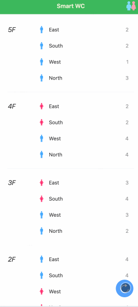

[English](README.md) | [中文版](README_zh.md)

[](https://github.com/tuya/smart-wc/blob/main/LICENSE 'License')

`smart-wc` provides a real-time query function for available toilet stalls, allowing users to quickly find available toilet stalls. It is a minimalist smart toilet service solution, mobile-first, supports multiple device categories, and has flexible configuration.  


## One-click quick experience
1. Prerequisites: Make sure [Node.js](https://nodejs.org/) and [Git](https://git-scm.com/) are installed, where Node.js version >= 18.0.0.
2. The one-click quick experience starts the project in a mock mode, no need to connect and configure real devices, you can quickly experience the page function.

### Mac/Linux
```bash
curl -s https://raw.githubusercontent.com/tuya/smart-wc/main/quickstart.sh | bash
```

## Configuration
Configuration file: `config.json`, located in the project root directory, each field is explained as follows:
```json
{
  "access_key": "Tuya Cloud Project Access ID", 
  "secret_key": "Tuya Cloud Project Access Secret",
  "region": "Data center, not required, default China region, support: CN-China, US-West, UEAZ-East US, EU-Europe, WEAZ-West Europe, IND-India",

  // Strategy configuration, supports multiple strategies, such as some stalls are judged by door magnetic switches, some are judged by infrared sensors, and some are judged by human presence sensors
  "strategy": [
    {"category": "Category", "code": "Function point, can be used to judge whether there are people/no people", "value": "Represents the status value when there are no people, indicating that the current stall is free"}
  ],

  // Toilet building configuration, configured by floor, each floor can configure multiple toilets, each toilet can configure multiple stalls
  "building": {
    "name": "Building name",
    "wc":[
      {
        "floor": "Floor",
        "list": [
          {
            "gender": "Gender: male/female",
            "devices": [
              "Device Id, generally one stall installs one device, used to judge whether there are people/no people in the stall"
            ],
            "location": "Toilet location description, such as: east side"
          }
        ]
      }
    ]
  }
}
```  

### Configuration example
```json
{
  "access_key": "steh*******h4d",
  "secret_key": "fdcdfa***********080665",

  "strategy": [
    {"category": "mcs", "code": "doorcontact_state", "value": true}, // Door magnetic device
    {"category": "hps", "code": "presence_state", "value": "none"}   // Human presence sensor device
  ],

  "building": {
    "name": "XXX Building",
    "wc":[
      {
        "floor": "1F",
        "list": [
          {
            "gender": "Male",
            "devices": [
              "6c196********ewry7",
              "6cb23********fn72r"
            ],
            "location": "East"
          },
          {
            "gender": "Female",
            "devices": [
              "6cffe********ddlsoo",
              "6c16a********69gecp",
              "6c7c0*******6e5fhn"
            ],
            "location": "West"
          }
        ]
      },
      {
        "floor": "2F",
        "list": [
          {
            "gender": "Male",
            "devices": [
              "6c1588*******3akat8",
              "6c61d1*******47387q"
            ],
            "location": "East"
          },
          {
            "gender": "Female",
            "devices": [
              "6c590c*******6aereu",
              "6c549b*******86p0eh",
              "6c3629*******b5e3m6"
            ],
            "location": "West"
          }
        ]
      }
    ]
  }
}
```