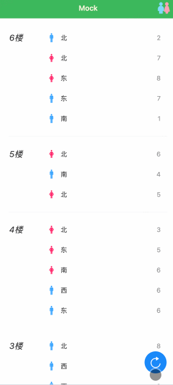

[English](README.md) | [中文版](README_zh.md)

[](https://github.com/tuya/smart-wc/blob/main/LICENSE 'License')

`smart-wc` 提供了厕所可用坑位的实时查询功能，便于用户快速找到可用的厕所坑位，是一个极简的智能厕所服务解决方案，移动端优先，支持多设备品类，配置灵活。  


## 一键快速体验
1、前置条件：确保已安装 [Node.js](https://nodejs.org/) 和 [Git](https://git-scm.com/)，其中 Node.js 版本 >= 18.0.0。  
2、一键快速体验是通过 mock 的方式启动项目，不需要连接和配置真实设备，可以快速体验页面功能。

### Mac/Linux
```bash
curl -s https://raw.githubusercontent.com/tuya/smart-wc/main/quickstart.sh | bash
```

## 配置说明
配置文件：`config.json`，位于项目根目录下，各字段说明如下：
```json
{
  "access_key": "Tuya 云项目 Access ID", 
  "secret_key": "Tuya 云项目 Access Secret",
  "region": "数据中心，非必填，默认中国区，支持：CN-中国、US-美西、UEAZ-美东、EU-欧洲、WEAZ-西欧、IND-印度",

  // 策略配置，支持多种策略，比如有些坑位是通过门磁开关判断，有些是通过红外传感器判断，有些是通过人体存在传感器判断
  "strategy": [
    {"category": "品类", "code": "功能点，可以用来判断有人/无人", "value": "表示无人时候的状态值，表明当前坑位空闲"}
  ],

  // 厕所建筑配置，按照楼层配置，每层楼可以配置多个厕所，每个厕所可以配置多个坑位
  "building": {
    "name": "建筑名称",
    "wc":[
      {
        "floor": "楼层",
        "list": [
          {
            "gender": "性别：男/女",
            "devices": [
              "设备 Id，一般一个坑位安装一个设备，用于判断坑位有人/无人"
            ],
            "location": "厕所位置描述，如：东侧"
          }
        ]
      }
    ]
  }
}
```  

### 配置示例
```json
{
  "access_key": "steh*******h4d",
  "secret_key": "fdcdfa***********080665",

  "strategy": [
    {"category": "mcs", "code": "doorcontact_state", "value": true}, // 门磁设备
    {"category": "hps", "code": "presence_state", "value": "none"}   // 人体存在传感器设备
  ],

  "building": {
    "name": "XXX 大厦",
    "wc":[
      {
        "floor": "1F",
        "list": [
          {
            "gender": "男",
            "devices": [
              "6c196********ewry7",
              "6cb23********fn72r"
            ],
            "location": "东"
          },
          {
            "gender": "女",
            "devices": [
              "6cffe********ddlsoo",
              "6c16a********69gecp",
              "6c7c0*******6e5fhn"
            ],
            "location": "西"
          }
        ]
      },
      {
        "floor": "2F",
        "list": [
          {
            "gender": "男",
            "devices": [
              "6c1588*******3akat8",
              "6c61d1*******47387q"
            ],
            "location": "东"
          },
          {
            "gender": "女",
            "devices": [
              "6c590c*******6aereu",
              "6c549b*******86p0eh",
              "6c3629*******b5e3m6"
            ],
            "location": "西"
          }
        ]
      }
    ]
  }
}
```